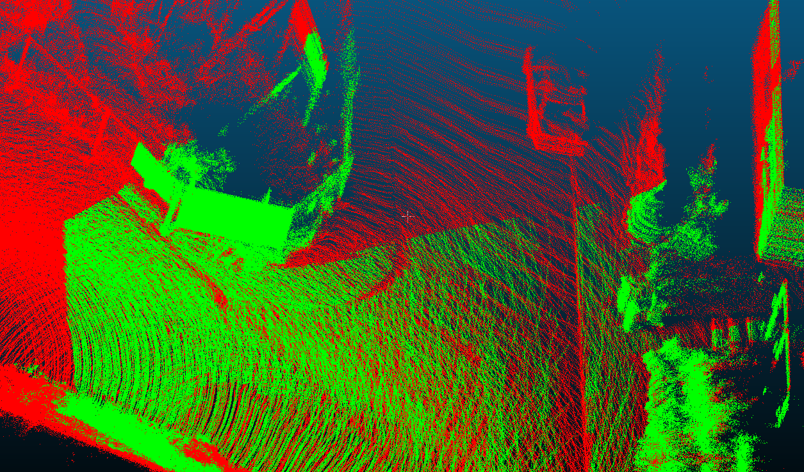

# VisCheck

Given a point cloud and parameter of a camera (intrinsics, pose, image dimension), this repo can give an estimation of whether a point can be observed by the camera.

The following image is a sample output. Green point means "visible" while red points means "not visible"



## Acknowledge

The algorithm in this repo is an implementation of [this paper](https://www.scitepress.org/Papers/2019/73086/pdf/index.html).

> Biasutti, P., Bugeau, A., Aujol, J. F., & Brédif, M. (2019). Visibility estimation in point clouds with variable density. VISIGRAPP 2019 - Proceedings of the 14th International Joint Conference on Computer Vision, Imaging and Computer Graphics Theory and Applications, 4, 27–35. https://doi.org/10.5220/0007308600270035

## Usage Sample

Check for the [sample program](./sample/visiblity_estimation.cc)

The hard-coded camera params can be used with the pointcloud in `data/`

```c++
visc::CamIntrinsics cam_intri{707.091, 707.091, 601.887, 183.11};
visc::RigidTransform6d cam_pose; // For trnsform ptcloud points into camera frame
cam_pose.matrix() << -0.00185776,   -0.999966, -0.00804016, -0.00478403,
                        -0.00648159,  0.00805223,   -0.999946,  -0.0733743,
                        0.999977, -0.00180569, -0.00649607,   -0.333997,
                        0,           0,           0,           1;

visc::VisCheck checker;  // Algorithm instance
checker.SetCamera(cam_intri, cam_pose, 1226, 370);  // Set camera params
checker.SetInputCloud(ptcloud_xyz); 
checker.SetK(50);  // Set K for K-nearest-neighbor algorithm

// We compute a visibility score for each point
// If the param is 0.0, then the mean of all visibility scores will be used
// as the threshold for determining if a point is visible
// If the param is 0.1, then the threshold is mean + 0.1
checker.SetVisScoreThreshMeanShift(0.0f);

// Actual computation happens here
// The result is a vector of indeces of the input pointcloud (visible points)
visc::PtIndices result;
checker.ComputeVisibility(result);
```